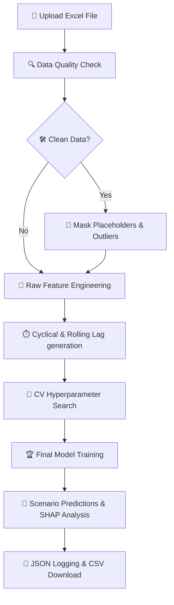

# Universal Time-Series Forecasting

[](https://www.python.org/)
[](https://streamlit.io/)
[](https://xgboost.readthedocs.io/)
[](https://shap.readthedocs.io/)
[](https://github.com/omidabduli/lake-simulation-timeseries/releases/latest)
[](https://github.com/omidabduli)
[](https://github.com/omidabduli/lake-simulation-timeseries/actions/workflows/deploy-pages.yml)

> **Universal Time-Series Forecasting** is an explainable forecasting and multi-domain scenario-analysis engine built for data scientists, financial analysts, engineers, researchers, and operations leaders. It combines structured Excel workflows, forward-only model validation, XGBoost forecasting, and TreeSHAP explanations in a clear, reproducible interface across any time-series domain.

**Use it online:** <https://omidabduli.github.io/lake-simulation-timeseries/>. The complete
Python engine runs inside your browser (WebAssembly), so uploaded workbooks never leave your device.

See the [v2.0.0 release notes](https://github.com/omidabduli/lake-simulation-timeseries/releases/tag/v2.0.0)
or review the complete [changelog](CHANGELOG.md).

---

## 🚀 Key Features

*   **⚡ Automated Machine Learning Pipeline**: Just upload your raw Excel file! The engine automatically parses historical records, aligns indices, runs target detection, and constructs features.
*   **🔍 Advanced Data Quality Auditing**: Scans data on-the-fly to discover missing placeholder values (e.g., `-999`, `-9999`) and statistical outliers using robust **Interquartile Range (IQR)** filtering.
*   **🧠 High-Performance Modeling**: Powered by **XGBoost** with automated **Time-Series Cross-Validation (TimeSeriesSplit)** hyperparameter optimization to prevent training leakages.
*   **🔮 SHAP Explainability (XAI)**: Demystifies the machine learning "black box" by calculating exact game-theory-based SHAP values, identifying which parameters drove the simulation outcomes.
*   **📚 Interactive Documentation Center**: Built-in 9-tab reference manual explaining Excel data specifications, XGBoost parameters, TimeSeriesSplit CV, cyclical feature math, TreeSHAP equations, and troubleshooting.
*   **🎨 Professional Scientific Interface**: A responsive, high-contrast workspace inspired by the Roland Digital visual system, with accessible labels and clear training feedback.
*   **📁 Structured Run Logging**: Automatically serializes accuracy metrics ($R^2$, RMSE), model parameters, and top SHAP drivers into JSON files for future AI analysis (written to `logs/` when run locally; in the browser build they stay in the tab's temporary file system).

---

## 🛠️ How It Works (Step-by-Step Workflow)



1.  **Upload File 📂**: Drop your `.xls` or `.xlsx` workbook. The system reads **Sheet 1** as history and **Sheets 2+** as scenario conditions.
2.  **Audit Data 🔍**: Review detected missing placeholders and outliers. Choose to clean specific columns or proceed with raw values.
3.  **Optimize 🚀**: Watch the live model console evaluate candidate configurations with forward-only validation. Advanced mode can adjust search effort, validation rigor, tree complexity, and rolling context windows.
4.  **Analyze 📊**: Explore interactive Plotly projections comparing history with predictions, backed by horizontal SHAP feature impact rankings.
5.  **Export ⬇️**: Download prediction outcomes formatted as standardized CSVs for German locales (`;` delimiter, `,` decimals).

---

## ⚙️ Under The Hood (ML Pipeline Details)

### 1. Cyclical Time Representations ⏰
Standard integers represent months (1–12) or hours (0–23) poorly, making December (12) and January (1) seem far apart. Lake Time-Series Forecasting projects dates onto a unit circle:
$$\text{month\_sin} = \sin\left(\frac{2\pi \cdot \text{month}}{12}\right), \quad \text{month\_cos} = \cos\left(\frac{2\pi \cdot \text{month}}{12}\right)$$

### 2. Temporal Smoothing & Continuous Time 📉
The default model calculates 3-observation and 7-observation rolling statistics
for every predictor. Advanced mode can add 14- or 30-observation context when
the measured system responds more slowly. Scenario dates share the historical
time origin, so the long-term trend continues into the future instead of
resetting when a scenario begins.

### 3. Hyperparameter Tuning 🎛️
During training, a Time-Series Split cross-validation optimizes the learning rate, maximum tree depth, and estimator size to ensure high generalization scores.

Advanced mode includes an explained **Expert model tuning** panel:

- **Search effort** controls how many candidate models are evaluated.
- **Time-series validation** controls the number of forward-only historical splits.
- **Model complexity** controls the tree-depth search range.
- **Rolling context windows** control how much short- and long-term predictor history is represented.

Start with the recommended Balanced profile and change one setting at a time.
Compare validation R² and RMSE rather than judging a model by training fit alone.

---

## 📂 Project Directory Structure

```text
├── app.py                     # 🌐 Main Streamlit Application & UI Layer
├── run.command                # ⚡ One-click macOS/Linux Shell Launcher
├── requirements.txt           # 📦 Python Package Dependencies (local / server)
├── .gitignore                 # 🚫 Git Exclude Patterns (filters large sheets)
├── .github/workflows/
│   └── deploy-pages.yml       # 🚀 Test, build and deploy to GitHub Pages on every push to main
├── web/                       # 🌍 GitHub Pages build (runs the app in the browser via stlite)
│   ├── index.html             # Host page: loads stlite + Pyodide and mounts the app
│   ├── entrypoint.py          # Browser entrypoint that runs app.py
│   ├── requirements.txt       # Python packages installed in the browser runtime
│   └── 404.html, favicon.png
├── scripts/build_site.py      # 🧱 Assembles the static site into _site/
├── legacy/server/             # 🗄️ Previous server deployment (Docker, Hetzner), kept for rollback
├── Example/                   # 📊 Demo workbook (2,000 historical rows + warming scenario)
├── tests/                     # ✅ Unit tests (python -m unittest discover -s tests)
├── modules/                   # 🧠 Core Backend Architecture
│   ├── __init__.py            # 📦 Module Package Setup
│   ├── data_loader.py         # 🗄️ Excel Ingestion & IQR Outlier Checks
│   ├── docs_view.py           # 📚 Interactive Documentation & Reference Manual
│   ├── feature_engineering.py  # 🧬 Sine/Cosine Cyclicals & Rolling Lags
│   ├── model.py               # 🌲 XGBoost Trainer Wrapper
│   ├── explainer.py           # 🔮 SHAP TreeExplainer Logic
│   ├── visualizer.py          # 🎨 Plotly Scientific Visualization Templates
│   └── logger.py              # 📝 Serialized JSON Run Logging
└── docs/                      # 📖 Deep Academic Documentation
    ├── Design.md              # 📐 UI/UX Design System Layout
    ├── Specification.md       # 📋 Detailed Project Specifications
    ├── documentation_de.md    # 🇩🇪 Comprehensive German Academic Docs
    ├── explanation_de.md      # 🇩🇪 Quick German User Explanation
    └── explanation_fa.md      # 🇮🇷 Quick Persian User Explanation
```

---

## 💻 Local Development

### 1. Clone the repository
```bash
git clone https://github.com/omidabduli/lake-simulation-timeseries.git
cd lake-simulation-timeseries
```

### 2. Run the Streamlit app locally (fastest edit–reload loop)
Requires **Python 3.9+**. On macOS, XGBoost also needs `libomp` (`brew install libomp`).

```bash
python3 -m venv .venv
source .venv/bin/activate
pip install -r requirements.txt
streamlit run app.py --server.port 8502
```

Open <http://localhost:8502>. On macOS you can also double-click `run.command` in Finder.

### 3. Preview the GitHub Pages build (exactly what is deployed)
No installs needed; the script uses only the Python standard library:

```bash
python3 scripts/build_site.py --serve
```

Open <http://127.0.0.1:8000/>. The first start downloads the in-browser Python runtime
(about 50 MB) from jsDelivr and PyPI; later starts load from the browser cache.

### 4. Run the tests
```bash
python -m unittest discover -s tests -v
```

---

## 📦 Production Build

```bash
python3 scripts/build_site.py
```

This writes the static site to `_site/`: `index.html` (loads [stlite](https://github.com/whitphx/stlite),
i.e. Streamlit on Pyodide/WebAssembly, pinned in `web/index.html`), `404.html`, `favicon.png`, and `app/`
with the Python sources, the demo workbook and `app/manifest.json`. New files in `modules/` are included
automatically; any other file the app opens at runtime must be added to `app_files()` in
`scripts/build_site.py`. Python packages for the browser runtime are listed in `web/requirements.txt`.

---

## 🚀 Deployment (GitHub Pages)

Pushing to `main` deploys automatically. The workflow `.github/workflows/deploy-pages.yml`:

1. installs `requirements.txt` on Python 3.13 (the in-browser Python version),
2. runs the unit tests (a failing test stops the deployment),
3. builds `_site/` with `scripts/build_site.py`,
4. publishes it with the official `actions/upload-pages-artifact` and `actions/deploy-pages` actions.

It can also be started by hand from the **Actions** tab (**Run workflow**).

**One-time setup:** in the repository open **Settings → Pages** and set **Source** to **GitHub Actions**.

### GitHub Pages URL
Project sites are published at `https://USERNAME.github.io/REPOSITORY/`. For this repository:

**<https://omidabduli.github.io/lake-simulation-timeseries/>**

All asset and file paths are relative, so the site works under this sub-path and at the root of a custom domain.

### Custom domain
The intended production address is `time-series.roland-digital.de`. With the GitHub Actions deployment,
the domain is configured in **Settings → Pages → Custom domain** (a `CNAME` file is ignored for this
deployment type, so the repository does not contain one). Once the site works on the `github.io` URL:

1. *(Recommended)* verify `roland-digital.de` under **GitHub → Settings → Pages → Add a domain** (adds a `TXT` record).
2. In the DNS zone of `roland-digital.de`, replace the `A` record of `time-series` with
   a `CNAME` record `time-series` → `omidabduli.github.io` (without the repository name).
3. Enter `time-series.roland-digital.de` as the custom domain and, once the certificate is issued, enable **Enforce HTTPS**.

Details and rollback: [MIGRATION_TO_GITHUB_PAGES.md](MIGRATION_TO_GITHUB_PAGES.md).

---

## 🏗️ Architecture

**Fully static, client-side application.** GitHub Pages serves only static files. In the visitor's
browser, stlite starts Pyodide (CPython compiled to WebAssembly) in a Web Worker, installs the
scientific stack (pandas, NumPy, scikit-learn, XGBoost, openpyxl, Plotly) and runs the same
Streamlit app (`app.py` and `modules/`) that also runs on a server. Parsing, training, validation, SHAP and charts all happen
on the device; nothing is uploaded anywhere.

```text
Browser ──► GitHub Pages (index.html + app/*.py) ──► stlite / Pyodide (Web Worker)
        ──► pandas · scikit-learn · XGBoost · Plotly ──► charts, SHAP, CSV download
```

The same code still runs as a regular Streamlit server (`streamlit run app.py`, or the container in
`legacy/server/`).

### Remaining server dependencies
None for the application itself. At runtime the browser downloads public, versioned assets from
two CDNs: jsDelivr (stlite, Pyodide and its packages) and PyPI (openpyxl, Plotly), and fonts
from Google Fonts. The only feature without a server-side equivalent is central collection of
the JSON run logs: in the browser they stay in the visitor's tab.

---

## 📊 File Formatting Guidelines

### Try the bundled demo

To test the complete workflow immediately, upload
`Example/Lake_Time_Series_Forecasting_Demo_2000_Rows.xlsx` in the app. It contains:

- **Historical** — 2,000 daily lake observations across 10 variables.
- **Scenario_Warming** — a 365-day future scenario with
  `Dissolved_Oxygen_mg_L` intentionally blank for the application to predict.

No editing is required; select the file and the simulation starts automatically.

---

To get accurate simulations, structure your Excel workbook as follows:

*   **Sheet 1 (Historical data)**:
    *   Must contain a chronological index column named `Time`, `Date`, `Datetime`, `Timestamp`, `Datum`, or `Zeit`.
    *   All other columns must contain numeric values (e.g., `temperature`, `oxygen`, `ph`, `precipitation`).
*   **Sheets 2+ (Scenarios)**:
    *   Must have the **exact same columns** as Sheet 1.
    *   Exactly **one** column must be left **entirely empty (NaN)**. This is the variable the AI will automatically identify as the target and predict for you.

---

## Author

**Developed and maintained by [Omid Abduli](https://github.com/omidabduli)**

[Roland Digital](https://roland-digital.de/) · Germany

*Explainable environmental time-series simulation for research and scenario analysis.*
